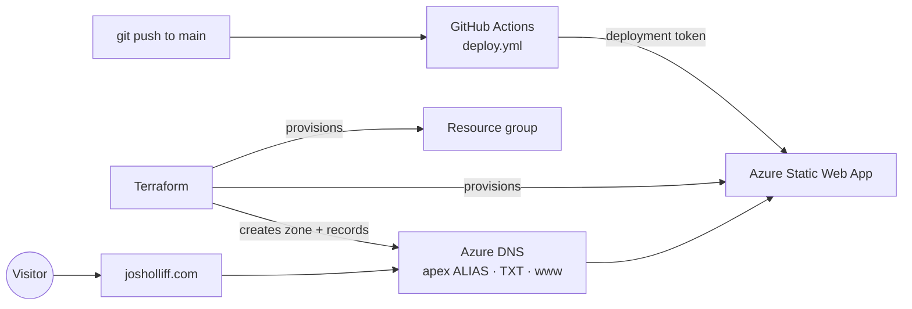

<div align="center">

# josholliff.com

**Josh Olliff — Systems Engineer** · a retro-terminal résumé site
hosted on **Azure Static Web Apps**, wired end-to-end with **Terraform**.

[**› Live at josholliff.com**](https://josholliff.com)

`Terraform` · `Azure Static Web Apps` · `Azure DNS` · `GitHub Actions` · `Static HTML/CSS/JS`

</div>

---

## Overview

A single-page, dependency-free résumé styled like a 1990s DOS/Windows terminal —
black background, VGA-silver text, one blue accent, CRT scanlines, and the
`Perfect DOS VGA` typeface. The whole thing (site **and** cloud infrastructure)
lives in this repo and ships automatically on every push to `main`.

## Features

- 🖥️ **Retro CRT theme** — scanline overlay, vignette, monospace DOS font, understated black / silver / blue palette.
- 🏆 **Certification badges** — self-contained hexagon SVGs beside each Microsoft cert (blue *Associate*, silver *Fundamentals*; expired certs greyed).
- 🎓 **Education badge** — a matching hex badge for Seminole State College.
- 📱 **Responsive** and **accessible** (semantic markup, alt text, reduced-color-friendly).
- 🔗 **Social-ready** — favicon plus Open Graph / Twitter card image for clean link previews.

## Tech stack

| Layer | Choice |
|---|---|
| Site | Hand-written HTML / CSS / vanilla JS — no framework, no build step |
| Hosting | Azure Static Web Apps (Free tier, free managed TLS) |
| DNS | Azure DNS zone (apex `ALIAS` + `www`), managed by Terraform |
| IaC | Terraform (`hashicorp/azurerm` ~> 4, `integrations/github` ~> 6) |
| CI/CD | GitHub Actions (`Azure/static-web-apps-deploy`) |

## Repository layout

```
.
├── src/                        # the deployed site
│   ├── index.html
│   ├── style.css
│   ├── script.js               # sets the footer year
│   ├── favicon.svg
│   ├── og.png                  # social-share card
│   ├── resume.pdf
│   ├── staticwebapp.config.json
│   └── badges/                 # self-contained SVG cert / school badges
├── terraform/                  # all Azure + GitHub infrastructure
│   ├── providers.tf
│   ├── main.tf                 # resource group, Static Web App, custom domains
│   ├── dns.tf                  # Azure DNS zone + apex/TXT/www records
│   ├── github.tf               # (optional) writes the deploy-token repo secret
│   ├── variables.tf
│   ├── outputs.tf
│   └── terraform.tfvars.example
└── .github/workflows/
    └── deploy.yml              # publishes src/ on push to main; PR previews
```

## How it fits together



Terraform provisions the app, the DNS zone, and the custom-domain bindings.
The GitHub Action uploads `src/` to the app using the Static Web App **deployment
token**. DNS routes `josholliff.com` (and `www`) at the app.

## Local development

The site is static — no toolchain required:

```bash
cd src
python3 -m http.server 8080     # then open http://localhost:8080
```

## Infrastructure & deployment

Prerequisites: [Terraform](https://developer.hashicorp.com/terraform) ≥ 1.5 and
the [Azure CLI](https://learn.microsoft.com/cli/azure/) (`az login`).

```bash
cd terraform
cp terraform.tfvars.example terraform.tfvars   # edit as needed
terraform init
terraform apply
```

**Deploy token → GitHub secret.** The workflow needs
`AZURE_STATIC_WEB_APPS_API_TOKEN`. Either let Terraform set it
(`manage_github_secret = true` + a `GITHUB_TOKEN` env var with repo-secret
rights), or copy it in manually:

```bash
terraform output -raw deployment_token
# GitHub → repo → Settings → Secrets and variables → Actions → new secret
```

Then push to `main` (or merge a PR) and `deploy.yml` publishes `src/`
automatically; pull requests get their own preview environment.

## Custom domain (Azure DNS)

Terraform creates and owns the `josholliff.com` DNS zone. Because a fresh zone
gets fresh name servers, and Azure validates domains over public DNS, bring-up
is **two-phase**:

1. **Create zone + apex** with `custom_domain = "josholliff.com"` and
   `enable_www = false`, then `terraform apply`.
2. **Delegate** the registrar to the zone's name servers
   (`terraform output -json dns_zone_name_servers`), wait for
   `nslookup -type=ns josholliff.com` to return `*.azure-dns.*`, then set
   `enable_www = true` and apply again.

`www` uses cname-delegation, which only validates *after* delegation — enabling
it in phase 1 makes the apply hang on an unresolvable record.

## Cost

Free-tier Static Web App ($0, includes managed TLS) + an Azure DNS zone
(~$0.50/mo). Effectively a couple of quarters a month.

---

<div align="center"><sub><code>&gt; end_of_file</code></sub></div>
